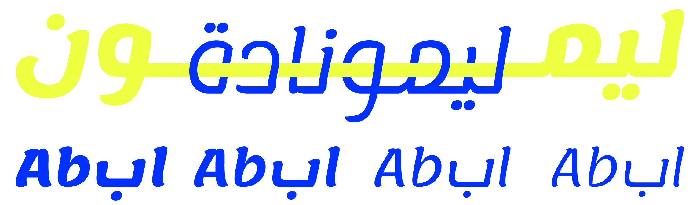

# Lemonada

Lemonada is a modern Arabic and Latin typeface family designed by Mohamed Gaber (Arabic) and Eduardo Tunni (Latin). 
It started with the Latin design Lemon by Eduaro Tunni, and then the Arabic was designed in a process of matchmaking. 
The Arabic design is contemporary, starting with Naskh and introducing influences of Diwani. 
With the readability of Naskh and beauty of Diwani, Lemonada can be used in both large and small sizes. 
It has wide and open counters that improve readability at smaller text sizes, while its more subtle details make it a great display face at larger sizes.
Lemonada currently spans four weights (Light, Regular, SemiBold and Bold) and has a wide character set that supports the Arabic, Farsi and Urdu languages.
